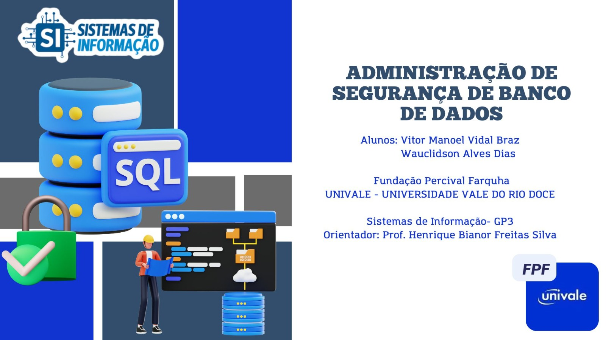

###

  
</div>

---

<h1 align="center">🛒 Empório VeWTech Conection Store</h1>

<p align="center">
  <strong>Trabalho Integrador de Administração e Segurança de Banco de Dados</strong><br>
  <strong>💻 UNIVALE - Sistemas de Informação | GP3 - 2025</strong>
</p>

---

## 📘 Descrição do Projeto

O projeto **Empório VeWTech Conection Store** simula a estrutura de um banco de dados real para uma loja de varejo, aplicando técnicas avançadas de administração e segurança. O foco está em **constraints, índices, procedures, controle de usuários e views**, com implementação em **MySQL 8.0+**.

---

## 🚀 Funcionalidades e Componentes

### 🧱 Modelagem e Constraints
- Tabelas: `clientes`, `produtos` e `vendas`
- Constraints aplicadas:
  - `PRIMARY KEY`, `NOT NULL`, `UNIQUE`
  - `CHECK` para regras de negócio (ex: idade mínima, preço positivo)
  - `FOREIGN KEY` com integridade relacional

### 📊 Índices Estratégicos
- Índice no CPF (`clientes`)
- Índice na data de venda (`vendas`)
- Análise de desempenho com `EXPLAIN`

### ⚙️ Stored Procedures
- `contar_clientes(OUT total)`
- `vendas_por_cliente(IN idCliente, OUT totalVendas)`
- `adicionar_produto(IN nome, IN preco, IN estoque)`

### 🔐 Gestão de Usuários e Permissões
- `admin_wauclidson` – acesso total
- `vendedor_vitor` – acesso a `vendas`
- `visualizador_henrique` – acesso à view personalizada

### 👁️ View Relacional
```sql
CREATE VIEW view_relatorio_clientes AS
SELECT 
    c.nome AS cliente,
    c.cpf,
    COUNT(v.id) AS total_vendas
FROM 
    clientes c
LEFT JOIN 
    vendas v ON c.id = v.cliente_id
GROUP BY 
    c.id;
```

---

## 🛠️ Tecnologias Utilizadas

- **Banco de Dados:** MySQL 8.0+
- **Ferramentas:** MySQL Workbench, Canva (modelagem)
- **Scripts:** SQL com comandos `CREATE`, `ALTER`, `GRANT`, `PROCEDURE`, `VIEW`, `INDEX`

<div align="left">
  
</div>

---

## 🗃️ Estrutura do Banco

```bash
📁 emporiovewtech_conection_store.sql
├── clientes
├── produtos
├── vendas
└── view_relatorio_clientes
```

📌 Arquivo `.sql` pronto para importação no MySQL Workbench.

---

## 📂 Acesso aos Arquivos

- 📁 Google Drive:  
  [Clique aqui para acessar os arquivos do projeto](https://drive.google.com/drive/folders/1wP-BqIh0mwxGh57NtRyHPkox3uREXHRy?usp=sharing)

- 🧩 Ilustração gráfica da modelagem (Canva):  
  [Visualizar modelagem ER](https://www.canva.com/design/DAGo2fmnNSk/darwbZYl3GkTWQOTAz0b4A/edit?utm_content=DAGo2fmnNSk&utm_campaign=designshare&utm_medium=link2&utm_source=sharebutton)

---

## 👨‍💻 Autores

- 🧑‍💻 Vitor Manoel Vidal Braz  
  🔗 [Linktree](https://linktr.ee/vitormanoelvb)  
  🔗 [GitHub](https://github.com/vitormanoelvb/trabalho_integrador_emporiovewtech_connection_store)

- 👨‍💻 Wauclidson Alves Dias  
  🔗 [Linkfly](https://linkfly.to/waudias)  
  🔗 [GitHub](https://github.com/WAUCLIDSON/EmporioVeWTech-DBA)

---

## 🎓 Orientação

- 🧑‍🏫 Professor: Henrique Bianor Freitas Silva  
- 🎓 Instituição: UNIVALE – Universidade Vale do Rio Doce  
- 📚 Disciplina: Administração e Segurança de Banco de Dados  
- 📅 Período: 3º (2025)

---

## 📌 Conclusão

Este projeto permitiu aplicar com sucesso conceitos fundamentais de modelagem, segurança e desempenho em bancos de dados relacionais. Todas as práticas foram testadas e comprovadas, simulando um ambiente corporativo realista e seguro.

---

## 🙏 Agradecimentos

> "Nosso muito obrigado à UNIVALE e à Fundação Percival Farquhar pelo suporte e estrutura educacional. Agradecemos também ao Professor Henrique por sua dedicação e orientação. Este trabalho representa nossa evolução prática no domínio de banco de dados."

---

## ⚠️ Aviso

Este é um projeto acadêmico com fins educacionais. Não utilizar em produção sem adaptações de segurança e validações complementares.
